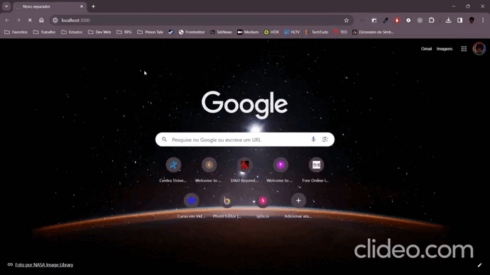

# Pagamentos APP

# Ponto de Venda

Este projeto é uma aplicação de Ponto de Venda (PDV) desenvolvida como  Next.js e React Query. O sistema permite a manipulação de produtos (CRUD completo), navegação por categorias de produtos e simulação de compras através de um carrinho de compras. 

### Tecnologias Utilizadas
- React.js
- TypeScript
- React Query
- Next.js
- HTML
- CSS

## 📝 Licença

Esse projeto está sob licença. Veja o arquivo [LICENÇA](LICENSE.md) para mais detalhes.

